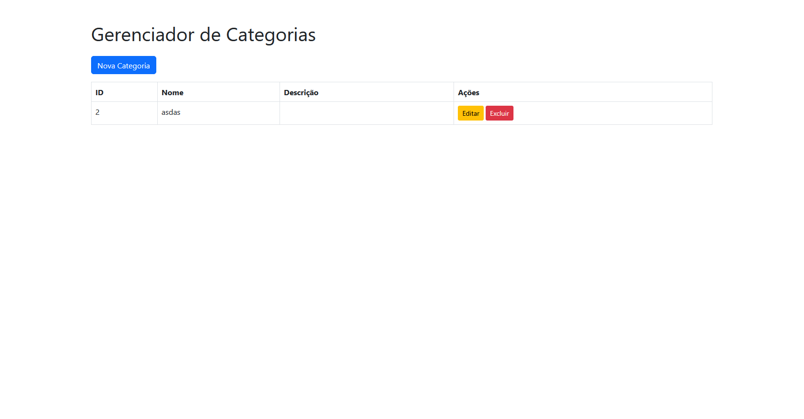

# Prova P2 - Backend

Esse projeto utiliza Laravel e Docker. Ele também utiliza Laravel Sail.

Para instalar:

1. **Clone o repositório:**

   ```bash
   git clone https://github.com/aksaraymalaklisi/prova-p2-backend.git
   cd gerenciador-categorias
   ```

2. **Instale as dependências (e Sail)**

    ```bash
    docker run --rm \
        -u "$(id -u):$(id -g)" \
        -v "$(pwd):/var/www/html" \
        -w /var/www/html \
        laravelsail/php8.3-composer:latest \
        composer install --ignore-platform-reqs
    ```

3. **Copie o arquivo .env**

    ```bash
    cp .env.example .env
    ```

4. **(Opcional)** Ajuste a porta
   
   ```bash
    APP_PORT=8080
    APP_URL=http://localhost:8080
    ```

5. **Inicie os contêineres e faça a migração**

    ```bash
    ./vendor/bin/sail up -d
    ```

    ```bash
    ./vendor/bin/sail artisan key:generate
    ./vendor/bin/sail artisan migrate
    ```

O projeto estará em <http://localhost:8080> (ou <http://localhost>):

